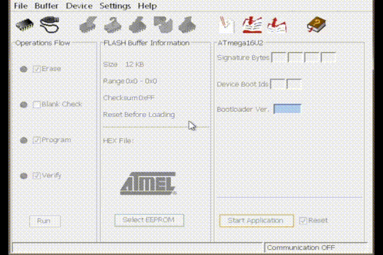

# iGuessr
A basic tool to guess iDevice passwords after they have been exploited to remove the passcode limit. Pretty much like a free alternative to the MFC dongle.
## How does this thing work?
Well its simple, we turn your Arduino into a virtual keyboard that will automatically type in codes from 0000 to 9999, there should also be a display connected to the Arduino that will display what codes it is trying and when the photoresistor detects a change in brightness (this usually means the device unlocked) the screen will display the last attempted code which should be the iDevice's lock code.
## Prerequisites
- Exploited iDevice
- Arduino UNO
- 2.4″ LCD Shield (Support for 16x2 lcd is coming soon)
- Photoresistor
- Usb A to B data cable
- Apple lightning to usb camera adapter or the 30pin version
## Build Guide
Let's build shall we?

1. First you need to have the Arduino IDE downloaded. [Link to the Arduino site](https://www.arduino.cc/en/software)
2. In this github you will find a file named iGuessr_sketch.ino, upload this sketch to the ardunio (If you get any errors
it likely means you're missing a few library's like Adafruit_GFX or Adafruit_TFTLCD, just download them and retry)
3. Once the sketch is uploaded you need to download Atmel Flip [Link to Atmel Flip page](https://www.microchip.com/en-us/development-tool/flip),
This tool will turn the Arduino into a keyboard and back to stock if you want to reuse it later.
(Also very important, when downloading Flip you need to download the one with the Java Runtime Environment included to avoid issues)
4. You will need to short 2 specific pins as shown in the picture to put the Atmega16u2 chip into a dfu like state

5. Once you're Arduino is in dfu mode, you will need to upload the iGuessr-Mode.hex file, in Atmel Flip you will need to specify your chip (Atmega 16u2) 
then you connect to the Arduino, select the correct hex file and upload.  

